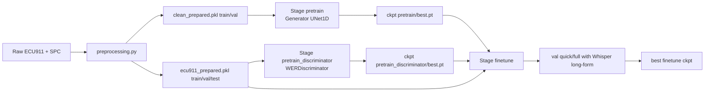
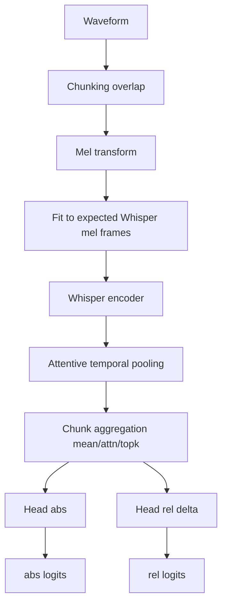

# ASR-aware-speech-enhancement
ASR-Aware Multibranch Enhancer (AME): A weakly supervised generative adversarial network for speech enhancement in emergency calls. Optimizes Automatic Speech Recognition (ASR) performance under low-resource conditions without requiring paired clean-noisy data.

## 1) Objective and Context

This project optimizes intelligibility (WER) in telephonic emergency audio, operating under a primary scenario where **perfect clean/noisy pairs are unavailable for the ECU911 dataset**.

The final strategy is implemented in stages:

1.  `preprocessing`: Construct robust WER labels and reproducible data splits.
2.  `pretrain`: Stabilize the Generator using acoustic objectives.
3.  `pretrain_discriminator`: Train `D_WER` to estimate relative/absolute quality.
4.  `finetune`: Optimize the Generator with acoustic anchors + adversarial regularization based on WER.
5.  `adversarial` (optional): Perceptual reinforcement using GANs.

**Main Implementation Files:**

- `preprocessing.py`
- `utils/data.py`
- `models/generator.py`
- `models/wer_discriminator.py`
- `trainers/trainer_pretrain.py`
- `trainers/trainer_werd.py`
- `trainers/trainer_finetune.py`
- `engine/validation.py`

---

## 2) Data Pipeline and Preprocessing

### 2.1 Preprocessing Inputs and Outputs

`preprocessing.py` generates:

- `data/processed/ecu911_prepared.pkl` containing `{train, val, test, metadata}`
- `data/processed/clean_prepared.pkl` for SPC containing `{train, val, metadata}`

### 2.2 WER Labeling for ECU911 Training

**Decisions:**

- Training WER is calculated using Whisper in **long-form mode by chunks** (not just the first fragment).
- Text is normalized uniformly (`normalize_text_for_wer`).
- `quality_score = 1/(1+WER)` to naturally support WER > 1.

**Justification:**

- WER > 1 occurs due to insertions; truncating or saturating values leads to unstable targets.
- Long-form processing reduces bias in long clips compared to calculating WER only on the initial 30s.

### 2.3 Data Splits

`process_ecu911_train`:

- `shuffle` with a fixed `seed`.
- Split by `train_split` (default 0.9) into `train` and `val`.

`process_ecu911_test`:

- Uses WER from the test CSV (no recalculation via Whisper).

### 2.4 Dataset and Collate

`ECU911Dataset` (`utils/data.py`):

- `stage`: `train | val | test`.
- `purpose=default`: Uses `quality_score` from pickle or derives it.
- `purpose=wer_disc`: Robust target derived from WER + outlier filters (`wer_filter_max_*`).

`collate_ecu911` delivers:

- `waveform (B,T)` with padding
- `durations`
- `transcripts`
- `audio_paths`
- `wer`, `quality_scores`, `quality_mask`
- Auxiliary ASR decoder metrics (if available)

### 2.5 SPC (Paired Corpus)

`SpanishConversationalDataset`:

- Extracts segments from TXT files with timestamps.
- Filters non-semantic metadata lines.
- Optionally degrades clean audio using `TelephoneDegradation`.

`TelephoneDegradation` simulates:

- Telephone bandwidth (300-3400 Hz).
- Downsample to 8k + mu-law + upsample.
- Soft AGC, controlled noise by SNR, slight distortion.
- Volume variation per segment (simulating speaker turns).

---

## 3) Model Architecture

### 3.1 Generator (`models/generator.py`)

**Model:** `UNetEnhancer` 1D

- **Input:** Mono waveform.
- **Encoder:** `DownBlock` with stride 2.
- **Bottleneck:** Stacked `ResBlock`s.
- **Decoder:** `UpBlock` with skip connections.
- **Output:** Residual mask `tanh`, applied as:
  - `enh = inp + 0.5 * mask * inp`
  - Final clamp to `[-1, 1]`.

**Design Rationale:**

- Residual masking reduces the risk of "hallucinating" audio.
- 1D U-Net maintains temporal detail for voice enhancement.

### 3.2 WER Discriminator (`models/wer_discriminator.py`)

**Core:**

- Whisper Encoder (`transformers.WhisperModel`) for semantic embeddings.
- Chunking of long waveforms (`chunk_seconds`, `chunk_overlap_seconds`).
- Mel spectrograms with **padding/truncation to expected Whisper frames** (3000 by default in HF implementation).
- `AttentivePool` temporal pooling over tokens.

**Heads:**

- `head_abs`: Absolute quality logit.
- `head_rel_delta`: Relative delta; `rel = abs + delta`.

**Chunk Aggregation:**

- `mean`
- `attn`
- `mean_topk` (mix of global mean + mean of "hardest" chunks)

**Optional Branches:**

- `acoustic_branch` (CNN on mel without artificial padding).
- `wave_multiscale_branch` (1D CNN at various scales).

**Optional Domain Calibration:**

- Numerical metadata: duration, RMS, crest factor.
- Channel embedding (extracted from `audio_path` type `CHxx`).
- Additive fusion via `meta_proj`.

**Design Rationale:**

- Whisper provides strong semantic signals for intelligibility.
- Chunking avoids OOM (Out Of Memory) errors with long audios.
- Optional branches allow adding pure acoustic evidence when semantic embeddings are insufficient.

### 3.3 GAN Discriminator (`models/discriminator.py`)

`PatchDiscriminator1D`:

- Hierarchical Conv1D with LeakyReLU.
- Average temporal score.

**Usage:**

- Only in the optional `adversarial` stage.

---

## 4) Loss Functions

Implemented in `engine/losses.py` and trainers.

### 4.1 Acoustic Base

- `L_mrstft`: Mean of L1 on multi-resolution STFT magnitude.
- `L_si_sdr`: `-SI-SDR`.
- `L_l1`: L1 on waveform.

### 4.2 Pretrain (Generator)

`L = w_mrstft * L_mrstft + w_sisdr * L_sisdr + w_l1 * L_l1`

### 4.3 Adversarial Stage

**Discriminator (hinge):**

- `L_D = 0.5 * (relu(1 - D(real)) + relu(1 + D(fake)))`

**Generator:**

- `L_G = L_mrstft + 0.4*L_sisdr + 0.1*L_adv`
- `L_adv = -E[D(G(noisy))]`

### 4.4 Pretrain D_WER

**Targets (depending on mode):**

- `quality_sigmoid`: `q = sigmoid(-(log1p(min(wer, cap)) - mu)/sigma)`
- `log_wer`: `log1p(wer)`
- `quantile_logwer`: Normal score by log-WER quantiles.
- `hybrid`: Mix of probability and logit objectives.

**Supervision Loss:**

- SmoothL1 on logits or probs depending on `target_mode`.

**Ranking Loss:**

- Listwise hard pairs based on quality difference.
- Weighting by target separation.

**Total Loss (default):**

- `L = sup_weight * L_sup + rank_weight * L_rank`
- Optional distillation and auxiliary decoder metrics.

### 4.5 Finetune (Generator + Frozen D_WER)

**Base:**

- `L_anchor = stft_anchor_weight * MRSTFT(enh, noisy) + identity_l1_weight * L1(enh, noisy)`

**Optional Semantic Anchor:**

- L1 between Whisper encoder features of `enh` and `noisy`.

**Optional WER-adv (uses D_WER output):**

- Modes: `pairwise`, `pairwise_margin`, `abs_mean`, `abs_margin`.
- Includes warmup, step frequency, and optional clipping.

**Design Rationale:**

- The main objective in finetune is to **improve WER without destroying the original signal**.
- Hence, strong anchors to `noisy` and a controlled adversarial component are used.

---

## 5) Training Stages and Checkpoint Selection

**Entry point:** `train.py`

**Supported Stages:**

- `pretrain`
- `adversarial`
- `pretrain_discriminator`
- `finetune`

**Checkpointing (`engine/checkpointing.py`):**

- Always saves `last.pt`.
- Saves `best.pt` only if `score` improves.

**`best` Criterion:**

- `pretrain_discriminator`: Maximizes correlation metric (default Spearman).
- Other stages: Minimizes `wer_enh` of full validation.

`build_state` moves states to CPU before serialization to avoid retaining CUDA tensors between epochs.

---

## 6) Validation and Metrics

**Main Validation:** `validate_wer_ecu911` (`engine/validation.py`)

- Chunked inference of the Generator with anti-OOM fallback.
- Whisper long-form transcription.
- **Metrics:**
  - `wer_noisy`, `wer_enh`, `wer_gain`
  - Corpus version (`\*_corpus`)
  - Counters for fallback/precomputed/OOM

**Quick vs Full Val:**

- **Quick:** Small subset (e.g., 48 samples).
- **Full:** Larger subset (e.g., 128 samples or full dataset depending on availability).
- In real training, full val runs every `full_val_every_epochs`.

**D_WER Validation:**

- Pearson/Spearman correlations with quality and logWER.
- Pairwise ranking accuracy.

---

## 7) Multi-GPU Design and Memory Management

**Default Assignment (`engine/devices.py` in HPC 3 GPU setup):**

- `train_device = cuda:0`
- `whisper_device = cuda:1`
- `validate_device = cuda:2`

**In Finetune:**

- D_WER runs on `whisper_device`.
- Validation can use a copy of the Generator on `validate_device` (`validate_generator_on_validate_device=true`).

**Anti-OOM Strategies in Finetune:**

- Training chunking (`train_chunk_seconds`).
- Curriculum learning by chunk per epoch.
- Adaptive backoff (`oom_chunk_backoff`) down to `oom_min_chunk_seconds`.
- Selective CUDA cache cleaning on non-train devices (`_clear_nontrain_cuda_memory`).
- Total cleanup only on OOM events.
- Skipping steps with non-finite loss/gradients.

---

## 8) Timeline of Observed Problems and Mitigations

### 8.1 Critical Problem: Stable Epoch 1, Epoch 2 Collapses due to OOM

**Observed Pattern in Logs:**

- Epoch 1: Complete training with `train_chunk_seconds=30.0`.
- Start of Epoch 2: OOM from initial iterations.
- Many cases with `optimizer_steps=0`, `skipped_oom=450`.

**Real Reported Example:**

- GPU0 ~15.7 GiB total, very low free memory (e.g., 196 MiB or less).
- Failures requesting tensors of 236/212/190 MiB even after backoff.

**Impact:**

- Training without real updates for entire epochs.
- Extremely short epoch time (almost all batches skipped).

### 8.2 Evaluated Technical Hypotheses

1.  Memory fragmentation/reservations after validation and/or checkpointing.
2.  Footprint of optimizer state + unreleased activations.
3.  Aggressive reuse of CUDA cache on `train_device`.
4.  Mismatch between train chunk size and actual batch load.

### 8.3 Mitigations Applied in Code

1.  Generator validation on a dedicated device (`cuda:2`) with weight copying.
2.  Selective cache cleaning:
    - Do not touch `train_device` cache outside of OOM events.
3.  Detailed OOM logs per iteration and chunk.
4.  Persistent chunk backoff between epochs (`adaptive_chunk_seconds`).
5.  Checkpoint serialization on CPU to avoid CUDA retention.
6.  Zero-grad and stricter non-finite guards.

### 8.4 Practical Result

With aggressive configurations (30s, high adv weight), OOM risk persisted. With more conservative chunks (e.g., 22s) and tuned adversarial weight, the run stabilized:

- 10 complete epochs.
- `skipped_oom=0`.
- `optimizer_steps=113` per epoch.
- `best wer_enh` full-val ~`0.6979` (epoch 5).

**Lesson:**

- On 15.7 GiB, 30s chunks are on the edge for this stack.
- A stable configuration prioritizes update continuity over maximum context length.

---

## 9) Observed Results (Shared Runs)

### 9.1 Stable 10-Epoch Run (Summary)

**Findings:**

- No OOM.
- Full val (every 5 epochs) improved over noisy baseline:
  - Epoch 5 full: `wer_noisy=0.7108` -> `wer_enh=0.6979`, `gain=+0.0129`
  - Epoch 10 full: `wer_noisy=0.7108` -> `wer_enh=0.6994`, `gain=+0.0114`
- Final recorded `best`: `0.697942...`

**Interpretation:**

- Real and consistent improvement in full-val.
- No evidence of generator collapse.

### 9.2 Variability in Quick-Val

Oscillations in quick-val were observed, including negative gains at some points.

**Interpretation:**

- The small subset has high variance.
- Selection decisions should rely on full-val, not isolated quick-val results.

---

## 10) Current Flaws and Risks

1.  **High sensitivity to VRAM budget.**
    - Even with mitigations, settings near the limit may reactivate OOM.
2.  **Strong dependence on Whisper and HF Hub.**
    - Without cache/token, operational bottlenecks may occur.
3.  **Metric variability by subset (quick-val).**
    - Can induce erroneous conclusions if used as the sole criterion.
4.  **Train/val split by simple shuffle.**
    - Does not guarantee stratification by incident_type, channel, or duration.
5.  **Risk of over-regularization in finetune.**
    - Excessive `stft_anchor`/`identity` may limit WER improvement.
6.  **Opposite risk from high `wer_adv_weight`.**
    - May push the system towards unwanted artifacts or punctual degradation.
7.  **Adversarial stage is not the main validated flow in this iteration.**
    - Lack of systematic ablation of the net GAN contribution to final WER.
8.  **No formal statistical protocol in reported results (CI per run, multi-seed).**
    - Inferential robustness is lacking for paper publication.

---

## 11) Design Decisions and Justification

1.  **Use long-form WER for train labels**
    - *Justification:* Reduces bias from truncation and aligns with real long-audio evaluation.
2.  **`quality_score = 1/(1+WER)`**
    - *Justification:* Stable for arbitrarily high WER; keeps target in [0,1].
3.  **Train D_WER separately before finetune**
    - *Justification:* Decouples quality calibration problem from the enhancement problem.
4.  **Freeze D_WER in finetune (default)**
    - *Justification:* Avoids non-stationary adversarial dynamics and degradation via co-adaptation.
5.  **Acoustic anchors to `noisy` in finetune**
    - *Justification:* Control excessive waveform changes and preserve useful content.
6.  **Validation on dedicated GPU**
    - *Justification:* Reduces memory interference and stabilizes multi-epoch training.
7.  **Quick-val + Full-val**
    - *Justification:* Balance between frequent feedback and robust selection criteria.
8.  **Adaptive chunk backoff on OOM**
    - *Justification:* Prioritizes training continuity and avoids epochs without updates.

---

## 12) Architecture Diagrams (Mermaid)

### 12.1 End-to-End View


### 12.2 Internal Finetune Architecture

```mermaid
flowchart TD
    N[Noisy batch] --> G[Generator UNet1D]
    G --> E[Enhanced batch]

    N --> L1[MRSTFT(enh,noisy)]
    E --> L1
    N --> L2[L1(enh,noisy)]
    E --> L2

    N --> D0[D_WER frozen]
    E --> D1[D_WER frozen]
    D0 --> A[logits_noisy]
    D1 --> B[logits_enh]
    A --> ADV[WER-adv loss mode]
    B --> ADV

    N --> S0[Whisper encoder semantic]
    E --> S1[Whisper encoder semantic]
    S0 --> SEM[L_semantic]
    S1 --> SEM

    L1 --> SUM[Loss total]
    L2 --> SUM
    ADV --> SUM
    SEM --> SUM
    SUM --> OPT[Optimizer G]
```
### 12.3 D_WER por chunks


