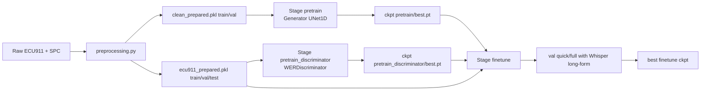
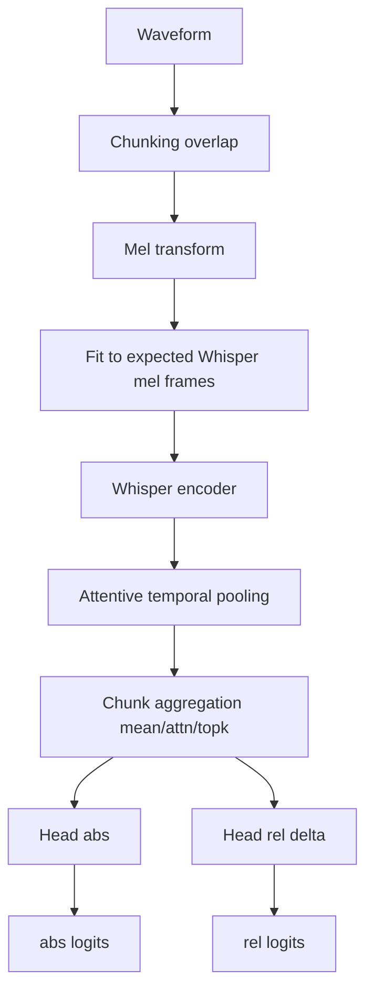

# Arquitectura y Resultados del Sistema de Speech Enhancement (ECU911)

## 1\) Objetivo y contexto

Este proyecto optimiza inteligibilidad (WER) en audio telefonico de emergencia,
con un escenario principal **sin pares clean/noisy perfectos en ECU911**.

La estrategia final es por etapas:

1.  `preprocessing`: construir labels WER robustos y splits reproducibles.
2.  `pretrain`: estabilizar el Generator con objetivos acusticos.
3.  `pretrain_discriminator`: entrenar `D_WER` para estimar calidad
    relativa/absoluta.
4.  `finetune`: optimizar Generator con anclas acusticas + regularizacion
    adversarial por WER.
5.  `adversarial` (opcional): refuerzo perceptual con GAN.

Implementacion principal:

- `preprocessing.py`
- `utils/data.py`
- `models/generator.py`
- `models/wer_discriminator.py`
- `trainers/trainer_pretrain.py`
- `trainers/trainer_werd.py`
- `trainers/trainer_finetune.py`
- `engine/validation.py`

- - -
## 2\) Pipeline de datos y preprocesamiento

### 2.1 Entradas y salidas del preprocessing

`preprocessing.py` genera:

- `data/processed/ecu911_prepared.pkl` con `{train, val, test, metadata}`
- `data/processed/clean_prepared.pkl` para SPC con `{train, val, metadata}`

### 2.2 Etiquetado WER para ECU911 train

Decisiones:

- WER train se calcula con Whisper en **modo long-form por chunks** (no solo
  primer fragmento).
- Texto normalizado de forma unica (`normalize_text_for_wer`).
- `quality_score = 1/(1+WER)` para soportar naturalmente WER > 1.

Justificacion:

- WER > 1 ocurre con inserciones; truncar o saturar da targets inestables.
- Long-form reduce sesgo de clips largos respecto a WER de 30s iniciales.

### 2.3 Splits

`process_ecu911_train`:

- `shuffle` con `seed` fija.
- split por `train_split` (default 0.9) en `train` y `val`.

`process_ecu911_test`:

- usa WER del CSV de test (sin recalculo Whisper).

### 2.4 Dataset y collate

`ECU911Dataset` (`utils/data.py`):

- `stage`: `train | val | test`.
- `purpose=default`: usa `quality_score` de pickle o lo deriva.
- `purpose=wer_disc`: target robusto desde WER + filtros de outliers (`
  wer_filter_max_*`).

`collate_ecu911` entrega:

- `waveform (B,T)` con padding
- `durations`
- `transcripts`
- `audio_paths`
- `wer`, `quality_scores`, `quality_mask`
- metricas auxiliares de decoder ASR (si existen)

### 2.5 SPC (corpus paired)

`SpanishConversationalDataset`:

- extrae segmentos desde TXT con timestamps
- filtra lineas de metadata no semanticas
- opcionalmente degrada audio limpio con `TelephoneDegradation`

`TelephoneDegradation` simula:

- banda telefonica 300-3400 Hz
- downsample a 8k + mu-law + upsample
- AGC suave, ruido controlado por SNR, distorsion leve
- variacion de volumen por segmentos (simula turnos de hablantes)

- - -
## 3\) Arquitectura de modelos

## 3.1 Generator (`models/generator.py`)

Modelo: `UNetEnhancer` 1D

- Entrada: waveform mono
- Encoder: `DownBlock` con stride 2
- Bottleneck: `ResBlock` apilados
- Decoder: `UpBlock` con skip connections
- Salida: mascara residual `tanh`, aplicada como:
  - `enh = inp + 0.5 * mask * inp`
  - clamp final a `[-1, 1]`

Razon de diseno:

- Residual masking reduce riesgo de "inventar" audio.
- U-Net 1D mantiene detalle temporal para enhancement de voz.

## 3.2 WER Discriminator (`models/wer_discriminator.py`)

Nucleo:

- Encoder Whisper (`transformers.WhisperModel`) para embeddings semanticos.
- Chunking de waveform largo (`chunk_seconds`, `chunk_overlap_seconds`).
- Mel con **padding/truncado a frames esperados de Whisper** (3000 por default
  HF).
- `AttentivePool` temporal sobre tokens.

Heads:

- `head_abs`: logit absoluto de calidad.
- `head_rel_delta`: delta relativo; `rel = abs + delta`.

Agregacion de chunks:

- `mean`
- `attn`
- `mean_topk` (mezcla media global + media de chunks mas "dificiles")

Ramas opcionales:

- `acoustic_branch` (CNN sobre mel sin padding artificial)
- `wave_multiscale_branch` (CNN 1D en varias escalas)

Calibracion de dominio opcional:

- metadata numerica: duracion, RMS, crest factor
- embedding de canal (extraido de `audio_path` tipo `CHxx`)
- fusion aditiva via `meta_proj`.

Razon de diseno:

- Whisper aporta señal semantica fuerte para inteligibilidad.
- Chunking evita OOM con audios largos.
- Branches opcionales permiten sumar evidencia acustica pura cuando el
  embedding semantico no basta.

## 3.3 GAN Discriminator (`models/discriminator.py`)

`PatchDiscriminator1D`:

- Conv1D jerarquico con LeakyReLU
- score promedio temporal

Uso:

- solo en stage `adversarial` opcional.

- - -
## 4\) Funciones de perdida (losses)

Implementadas en `engine/losses.py` y trainers.

### 4.1 Base acustica

- `L_mrstft`: media de L1 en magnitud STFT multiresolucion.
- `L_si_sdr`: `\-SI-SDR`.
- `L_l1`: L1 en waveform.

### 4.2 Pretrain (Generator)

`L = w_mrstft * L_mrstft + w_sisdr * L_sisdr + w_l1 * L_l1`

### 4.3 Adversarial stage

Discriminator (hinge):

- `L_D = 0.5 * (relu(1 - D(real)) + relu(1 + D(fake)))`

Generator:

- `L_G = L_mrstft + 0.4\*L_sisdr + 0.1\*L_adv`
- `L_adv = -E\[D(G(noisy))]`

### 4.4 Pretrain D_WER

Targets (segun modo):

- `quality_sigmoid`: `q = sigmoid(-(log1p(min(wer, cap)) - mu)/sigma)`
- `log_wer`: `log1p(wer)`
- `quantile_logwer`: normal score por cuantiles de log-WER
- `hybrid`: mezcla objetivo en probabilidad y en logit

Loss supervision:

- SmoothL1 sobre logits o probs segun `target_mode`

Loss ranking:

- listwise hard pairs por diferencia de calidad
- ponderacion por separacion de target

Loss total (default):

- `L = sup_weight * L_sup + rank_weight * L_rank`
- opcional distillation y auxiliar de decoder metrics.

### 4.5 Finetune (Generator + D_WER congelado)

Base:

- `L_anchor = stft_anchor_weight * MRSTFT(enh, noisy) + identity_l1_weight *
  L1(enh, noisy)`

Opcional semantic anchor:

- L1 entre features encoder Whisper de `enh` y `noisy`

Opcional WER-adv (usa salida de D_WER):

- modos: `pairwise`, `pairwise_margin`, `abs_mean`, `abs_margin`
- con warmup, frecuencia por pasos, clipping opcional.

Razon de diseno:

- El objetivo principal en finetune es **mejorar WER sin destruir señal original**
  .
- Por eso hay anclas fuertes a `noisy` y componente adversarial controlado.

- - -
## 5\) Stages de entrenamiento y seleccion de checkpoints

Entry point: `train.py`

Stages soportados:

- `pretrain`
- `adversarial`
- `pretrain_discriminator`
- `finetune`

Checkpointing (`engine/checkpointing.py`):

- siempre guarda `last.pt`
- guarda `best.pt` solo si mejora `score`

Criterio de `best`:

- `pretrain_discriminator`: maximiza metrica de correlacion (default Spearman).
- resto de stages: minimiza `wer_enh` de validacion full.

`build_state` pasa estados a CPU antes de serializar, para evitar retencion de
tensores CUDA entre epochs.

- - -
## 6\) Validacion y metricas

Validacion principal: `validate_wer_ecu911` (`engine/validation.py`)

- inferencia chunked del Generator con fallback anti-OOM
- transcripcion Whisper long-form
- metricas:
  - `wer_noisy`, `wer_enh`, `wer_gain`
  - version corpus (`\*_corpus`)
  - contadores de fallback/precomputed/OOM

Quick vs Full val:

- Quick: subset pequeno (ej. 48)
- Full: subset mayor (ej. 128 o dataset completo segun disponibilidad)
- en entrenamiento real, full val cada `full_val_every_epochs`.

Validacion de D_WER:

- correlaciones pearson/spearman con calidad y logWER
- accuracy de ranking por pares.

- - -
## 7\) Diseno multi-GPU y manejo de memoria

Asignacion por defecto (`engine/devices.py` en HPC 3 GPU):

- `train_device = cuda:0`
- `whisper_device = cuda:1`
- `validate_device = cuda:2`

En finetune:

- D_WER en `whisper_device`.
- validacion puede usar una copia de Generator en `validate_device` (`
  validate_generator_on_validate_device=true`).

Estrategias anti-OOM en finetune:

- chunking de entrenamiento (`train_chunk_seconds`)
- curriculum de chunk por epoch
- backoff adaptativo (`oom_chunk_backoff`) hasta `oom_min_chunk_seconds`
- limpieza selectiva de cache CUDA en no-train devices (
  `_clear_nontrain_cuda_memory`)
- limpieza total solo en evento OOM
- skip de pasos con loss/grad no finitos

- - -
## 8\) Cronologia de problemas observados y mitigaciones

### 8.1 Problema critico: Epoch 1 estable, Epoch 2 colapsa por OOM

Patron observado en logs:

- Epoch 1: entrenamiento completo con `train_chunk_seconds=30.0`
- Inicio Epoch 2: OOM desde iteraciones iniciales
- Muchos casos con `optimizer_steps=0`, `skipped_oom=450`

Ejemplo real reportado:

- GPU0 ~15.7 GiB total, libre muy baja (ej. 196 MiB o menos)
- fallos al pedir tensores de 236/212/190 MiB incluso tras backoff.

Impacto:

- entrenamiento sin updates reales en epochs enteras
- tiempo de epoch extremadamente corto (casi todo batches skippeados)

### 8.2 Hipotesis tecnicas evaluadas

1.  Fragmentacion/reservas de memoria tras validacion y/o checkpoint.
2.  Huella de estado de optimizer + activaciones no liberadas.
3.  Reuso agresivo de cache CUDA en `train_device`.
4.  Mismatch entre chunk de train y carga real por batch.

### 8.3 Mitigaciones aplicadas en codigo

1.  Validacion de Generator en device dedicado (`cuda:2`) con copia de pesos.
2.  Limpieza de cache selectiva:
  - no tocar cache de `train_device` fuera de OOM.
3.  Logs OOM detallados por iteracion y chunk.
4.  Backoff de chunk persistente entre epochs (`adaptive_chunk_seconds`).
5.  Serializacion de checkpoint en CPU para evitar retencion CUDA.
6.  Zero-grad y guards de no-finite mas estrictos.

### 8.4 Resultado practico

Con configuraciones agresivas (30s, alta carga adv), seguia habiendo riesgo de
OOM. Con chunk mas conservador (ej. 22s) y tuning de peso adversarial, el run
se estabilizo:

- 10 epochs completos
- `skipped_oom=0`
- `optimizer_steps=113` por epoch
- `best wer_enh` full-val ~`0.6979` (epoch 5)

Leccion:

- En 15.7 GiB, 30s puede quedar en el borde para este stack.
- Una configuracion estable prioriza continuidad de updates sobre contexto
  maximo.

- - -
## 9\) Resultados observados (corridas compartidas)

### 9.1 Corrida estable de 10 epochs (resumen)

Hallazgos:

- Sin OOM.
- Full val (cada 5 epochs) mejoro sobre noisy:
  - Epoch 5 full: `wer_noisy=0.7108` \-> `wer_enh=0.6979`, `gain=+0.0129`
  - Epoch 10 full: `wer_noisy=0.7108` \-> `wer_enh=0.6994`, `gain=+0.0114`
- `best` final registrado: `0.697942...`

Interpretacion:

- Mejora real y consistente en full-val.
- No hay evidencia de colapso del generator.

### 9.2 Variabilidad en quick-val

Se observaron oscilaciones de quick-val, incluyendo ganancias negativas en
algunos puntos.

Interpretacion:

- El subset pequeno tiene varianza alta.
- Las decisiones de seleccion deben apoyarse en full-val, no en quick-val
  aislado.

- - -
## 10\) Falencias y riesgos actuales

1.  Sensibilidad alta al presupuesto de VRAM.
  - Aun con mitigaciones, settings cercanos al limite pueden reactivar OOM.
2.  Dependencia fuerte de Whisper y HF Hub.
  - Sin cache/token puede haber cuellos de botella operativos.
3.  Variabilidad de metricas por subset (quick-val).
  - Puede inducir conclusiones equivocadas si se usa como criterio unico.
4.  Split train/val por shuffle simple.
  - No garantiza estratificacion por incident_type, canal o duracion.
5.  Riesgo de sobre-regularizacion en finetune.
  - Exceso de `stft_anchor`/`identity` puede limitar mejora WER.
6.  Riesgo opuesto por `wer_adv_weight` alto.
  - Puede mover el sistema hacia artefactos no deseados o degradacion puntual.
7.  Stage adversarial no es el flujo principal validado en esta iteracion.
  - Falta ablation sistematica del aporte neto de GAN en WER final.
8.  Sin protocolo estadistico formal en resultados reportados (CI por corrida,
    multi-seed).
  - Para paper, falta robustez inferencial.

- - -
## 11\) Decisiones de diseno y justificacion

1.  **Usar WER long-form para labels de train**
2.  Justificacion: reduce sesgo por truncamiento y alinea con evaluacion real
    long-audio.
3.  `quality_score = 1/(1+WER)`
4.  Justificacion: estable para WER arbitrariamente alto; mantiene target en
    \[0,1].
5.  **Entrenar D_WER por separado antes de finetune**
6.  Justificacion: desacopla problema de calibracion de calidad del problema de
    enhancement.
7.  **Congelar D_WER en finetune (default)**
8.  Justificacion: evita dinamica adversarial no estacionaria y degradacion por
    co-adaptacion.
9.  **Anclas acusticas a `noisy` en finetune**
10. Justificacion: controlar cambios excesivos del waveform y preservar
    contenido util.
11. **Validacion en GPU dedicada**
12. Justificacion: reduce interferencia de memoria y estabiliza entrenamiento
    multi-epoch.
13. **Quick-val + full-val**
14. Justificacion: equilibrio entre feedback frecuente y criterio de seleccion
    robusto.
15. **Backoff de chunk adaptativo ante OOM**
16. Justificacion: prioriza continuidad del entrenamiento y evita epochs sin
    updates.

- - -
## 12\) Diagramas de arquitectura (Mermaid)

### 12.1 Vista end-to-end


### 12.2 Arquitectura interna de finetune

```mermaid
flowchart TD
    N[Noisy batch] --> G[Generator UNet1D]
    G --> E[Enhanced batch]

    N --> L1[MRSTFT(enh,noisy)]
    E --> L1
    N --> L2[L1(enh,noisy)]
    E --> L2

    N --> D0[D_WER frozen]
    E --> D1[D_WER frozen]
    D0 --> A[logits_noisy]
    D1 --> B[logits_enh]
    A --> ADV[WER-adv loss mode]
    B --> ADV

    N --> S0[Whisper encoder semantic]
    E --> S1[Whisper encoder semantic]
    S0 --> SEM[L_semantic]
    S1 --> SEM

    L1 --> SUM[Loss total]
    L2 --> SUM
    ADV --> SUM
    SEM --> SUM
    SUM --> OPT[Optimizer G]
```
### 12.3 D_WER por chunks


- - -
## 13\) Recomendaciones para version paper

1.  Reportar siempre metrica principal con full-val (y test final separado).
2.  Incluir tabla de ablation:
  - sin/ con WER-adv
  - modos de `wer_adv_loss_mode`
  - con/sin semantic anchor
  - distintos chunk sizes.
3.  Reportar sensibilidad a seeds (minimo 3 corridas).
4.  Congelar una configuracion "estable de produccion" separada de exploracion.
5.  Añadir matriz de costos computacionales:
  - tiempo/epoch
  - VRAM pico por stage
  - costo por full-val.

- - -
## 14\) Estado actual sintetico

- El sistema ya tiene una arquitectura modular y defendible para paper.
- El problema principal historico fue estabilidad de memoria en finetune
  multi-epoch.
- Las mitigaciones implementadas permitieron corridas estables con mejora neta
  en full-val.
- El siguiente salto de calidad para paper es: ablation formal + replicacion
  multi-seed + test final fijo.
